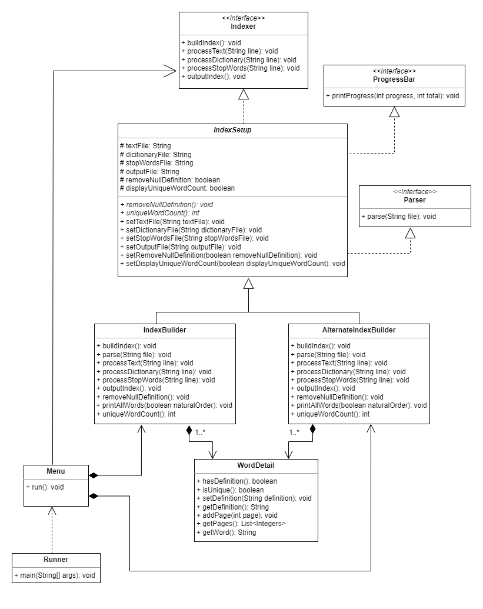

# Multithreaded-Indexing-API
College Assignment to create a Multithreaded Indexing API using virtual threads, that has a menu driven UI.
Submitted January 2023 for Advanced Object Orientated Programming Module.

## Project Requirements

To design and develop a multithreaded indexing API in Java 19+ that allows a word index to be created from an e-book. Logically, the index should contain a list
of words that relate to the page numbers on which they appear and the dictionary defined meaning of each word. You can assume that a page of text corresponds to 40 lines of text or blank spaces. 
Your API should also parse and process the 15Mb file “dictionary.csv”, which contains a set of over 176,000 words and their definitions. Google’s list of 1,000 most common words in English has been provided. Your API should exclude these words from the index.
- Use the package name ie.atu.sw
- Each sentence of the Dictionary and Google Words being parsed should be processed by a distinct virtual thread and should be implemented using structured concurrency (Project Loom). Do NOT use platform threads. You will need to ensure that the Map data structure thatyou use supports concurrent operations.
- The user of the API should not know how you are building the index, i.e. you should
encapsulate your data structure.
- All API operations on the index should be case insensitive.
- The definitions of words read from the dictionary should only be added to words that
exist in the text being parsed.
- The API should contain a method that outputs the index, with indentations, as text. It
should also expose a suite of methods appropriate to an index such as the following
(indicative only):
1. Return all words in sorted / reverse sorted order (maybe print 5 words / line)
2. The total number of unique words.
3. The top n most frequent / infrequent words
- You must comment each method in your application stating its running time (in Big-
O notation) and your rationale for its estimation.
- Provide a UML class diagram of your design and fully JavaDoc your code.

### Received Results: 90/100

## Running the API

Download the jar file and from it stored directory it is runnable using the following command in CLI: `java --enable-preview -cp ./indexer.jar ie.atu.sw.Runner` which
enables the virtual threads preview features.

The Dictionary file `dictionary.csv` and Google's 1000 most common words `google-1000.txt` used during the project have also be been provided.

## Command Line User Interface

**Options 1 through 4** are used to specify paths to files and index output location. These should all be
complete before using option 5 to build and output the index.

**Option 5** presents multiple choices: the first choice is two index types are available, the first excludes
stop words and the second an index of the stop words. The second choice is to display a unique word
count (one occurrence) at the beginning of the index. The third choice is to remove words with null
definitions (no definition was found in dictionary supplied). The index will then be built and output to
specified output location. If you want to build both indexes in one instance of the running the
application, specify a new output location (option 4) prior to building the second index to avoid
overwriting previous index.

**Option 6** presents options to print all words in index (5 per line) to the console in natural or reverse
alphabetical order. The index you wish to use should have been built prior using option 5, the UI warns
the user of this.

**Option 7** quits the application.

## Design

